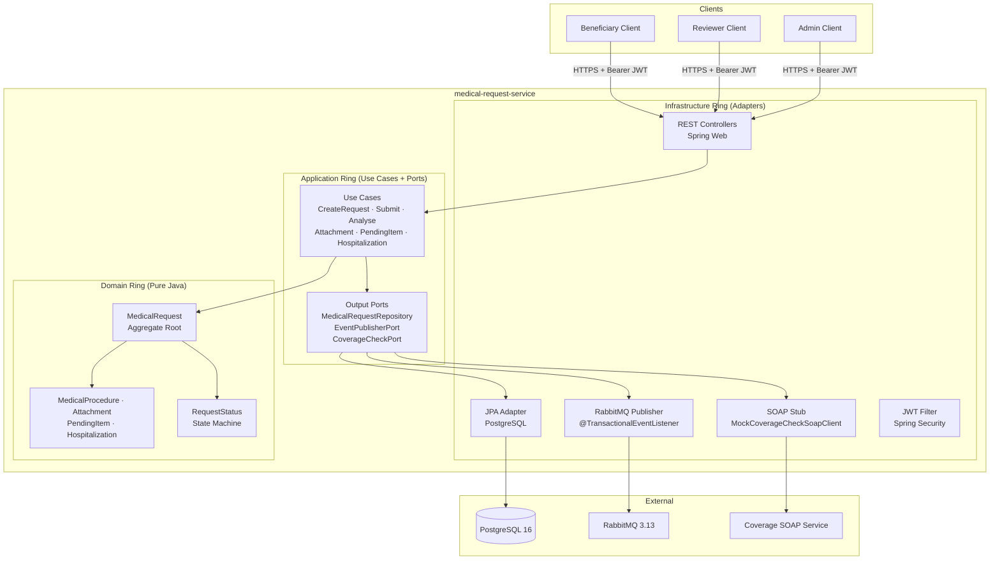

# Medical Request Service

> Spring Boot 3 microservice for managing medical procedure authorisation requests in a health insurance context — covering submission, clinical review, coverage validation, and final determination.
>
> Built with Hexagonal Architecture so the domain stays pure Java, use cases are testable without a Spring context, and infrastructure adapters (DB, broker, SOAP) are swappable without touching business logic.

---

## Architecture



Arrows point inward only — `Domain` knows nothing about `Application` or `Infrastructure`.

---

## Tech Stack

| Technology | Version | Role |
|---|---|---|
| Java | 21 | LTS; switch expressions in status mapping |
| Spring Boot | 3.3 | ProblemDetail (RFC 7807), @TransactionalEventListener |
| Spring Data JPA / Hibernate | 6.x | Persistence adapter |
| PostgreSQL | 16 | Primary store — UUID PKs, JSON columns |
| Spring Security + JJWT | 6.x / 0.12 | Stateless JWT auth |
| Spring AMQP / RabbitMQ | 3.13 | Async status-change events + DLQ |
| MapStruct | 1.5.5 | Compile-time, zero-reflection mappers |
| Lombok | 1.18 | Compile-time constructors and builders |
| springdoc-openapi | 2.5 | OpenAPI 3.0 — Swagger UI at `/swagger-ui.html` |
| H2 | test scope | In-memory DB for integration tests |
| JaCoCo | 0.8.11 | Coverage reports |

---

## Running Locally

```bash
git clone https://github.com/your-username/medical-request-service.git
cd medical-request-service
cp .env.example .env   # set your JWT secret here
docker compose up --build
```

| Service | URL |
|---|---|
| Swagger UI | http://localhost:8080/swagger-ui.html |
| RabbitMQ Management | http://localhost:15672 (guest/guest) |
| Health check | http://localhost:8080/actuator/health |

To run tests: `./mvnw verify`

---

## API Reference

All endpoints require `Authorization: Bearer <token>`.

| Method | Endpoint | Roles | Response |
|---|---|---|---|
| `POST` | `/api/v1/requests` | Any authenticated | `201 MedicalRequestResponse` |
| `GET` | `/api/v1/requests/{id}` | Any authenticated | `200 MedicalRequestResponse` |
| `GET` | `/api/v1/requests?beneficiaryId=&status=` | Any authenticated | `200 List<MedicalRequestResponse>` |
| `POST` | `/api/v1/requests/{id}/submit` | Any authenticated | `200 MedicalRequestResponse` |
| `POST` | `/api/v1/requests/{id}/cancel` | Any authenticated | `200 MedicalRequestResponse` |
| `POST` | `/api/v1/requests/{id}/analysis` | `REVIEWER` | `200 MedicalRequestResponse` |
| `POST` | `/api/v1/requests/{id}/attachments` | Any authenticated | `201 AttachmentResponse` |
| `GET` | `/api/v1/requests/{id}/attachments` | Any authenticated | `200 List<AttachmentResponse>` |
| `POST` | `/api/v1/requests/{id}/pending-items` | `REVIEWER`, `ADMIN` | `201 PendingItemResponse` |
| `PATCH` | `/api/v1/requests/{id}/pending-items/{itemId}/resolve` | `REVIEWER`, `ADMIN` | `200 MedicalRequestResponse` |
| `POST` | `/api/v1/requests/{id}/hospitalization` | Any authenticated | `200 MedicalRequestResponse` |

### Request lifecycle

DRAFT ──► SUBMITTED ──► UNDER_REVIEW ──► APPROVED
│ │ ├──► REJECTED
│ │ └──► PENDING ──► UNDER_REVIEW
└────────────┴───────────────────► CANCELLED