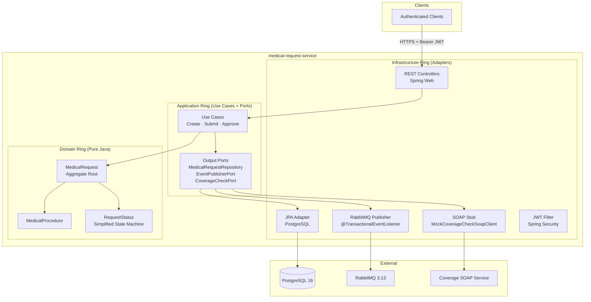

# Medical Request Service

> Spring Boot 3 microservice for managing medical procedure authorization requests in a health insurance context.
>
> Built with Hexagonal Architecture to demonstrate clean separation between domain, application, and infrastructure layers. Focused learning project showcasing core architectural patterns without unnecessary complexity.

---

## Architecture



Arrows point inward only — `Domain` knows nothing about `Application` or `Infrastructure`.

---

## Tech Stack

| Technology | Version | Role |
|---|---|---|
| Java | 21 | LTS; switch expressions in status mapping |
| Spring Boot | 3.3 | ProblemDetail (RFC 7807), @TransactionalEventListener |
| Spring Data JPA / Hibernate | 6.x | Persistence adapter |
| PostgreSQL | 16 | Primary store — UUID PKs, JSON columns |
| Spring Security + JJWT | 6.x / 0.12 | Stateless JWT auth |
| Spring AMQP / RabbitMQ | 3.13 | Async status-change events + DLQ |
| MapStruct | 1.5.5 | Compile-time, zero-reflection mappers |
| Lombok | 1.18 | Compile-time constructors and builders |
| springdoc-openapi | 2.5 | OpenAPI 3.0 — Swagger UI at `/swagger-ui.html` |
| H2 | test scope | In-memory DB for integration tests |
| JaCoCo | 0.8.11 | Coverage reports |

---

## Running Locally

```bash
git clone https://github.com/your-username/medical-request-service.git
cd medical-request-service
cp .env.example .env   # set your JWT secret here
docker compose up --build
```

| Service | URL |
|---|---|
| Swagger UI | http://localhost:8080/swagger-ui.html |
| RabbitMQ Management | http://localhost:15672 (guest/guest) |
| Health check | http://localhost:8080/actuator/health |

To run tests: `./mvnw verify`

---

## API Reference

All endpoints require `Authorization: Bearer <token>`.

| Method | Endpoint | Description | Response |
|---|---|---|---|
| `POST` | `/api/requests` | Create a new medical request (DRAFT) | `201 MedicalRequestResponse` |
| `POST` | `/api/requests/{id}/submit` | Submit a DRAFT request for approval | `200 MedicalRequestResponse` |
| `POST` | `/api/requests/{id}/approve?approved=true/false` | Approve or reject a SUBMITTED request | `200 MedicalRequestResponse` |

### Request lifecycle

DRAFT ──► SUBMITTED ──► APPROVED
  │           │         REJECTED
  └───────────┴────► CANCELLED

**Simplified state machine:**
- Create request → `DRAFT`
- Submit → `SUBMITTED`
- Approve/Reject → `APPROVED` or `REJECTED`
- Cancel available from `DRAFT` or `SUBMITTED`
